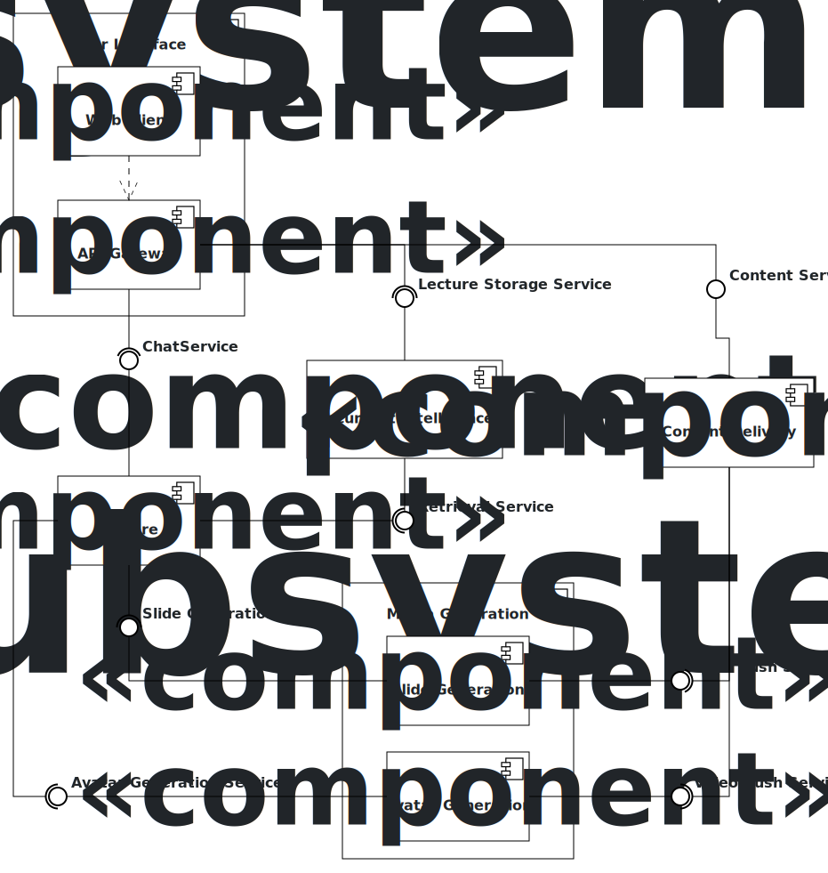

# Orpheus
The Orpheus System transforms static slides into interactive lecture videos with lifelike professor avatars, combining expressive narration, visual presence, and dynamic content to create engaging, personalized learning experiences.

## Architecture
<!---
The diagram was created with [Apollon](https://apollon.ase.in.tum.de/).
You can edit it by adjusting [OrpheusArchitecture.apollon](./OrpheusArchitecture.apollon).
We recommend using [VsCode](https://code.visualstudio.com/) with the [Apollon Extension](https://marketplace.visualstudio.com/items?itemName=TUMAET.apollon-vscode) to do so.

Once you edited the diagram, make sure to export it as svg to replace the existing [OrpheusArchitecture.svg](./OrpheusArchitecture.svg).
-->

  

## API Interface Documentation

Once you edited the diagram, make sure to export it as svg to replace the existing [OrpheusArchitecture.svg](./OrpheusArchitecture.svg).
-->

  

| Service                      | Description                                                                                                                                                                              | OpenAPI Specification                                                                  |
|------------------------------|------------------------------------------------------------------------------------------------------------------------------------------------------------------------------------------|----------------------------------------------------------------------------------------|
| **AI Core**                  | Orchestrates lecture generation from user prompts, creating a lecture script, and managing asynchronous jobs for creating interactive slides and videos with lifelike professor avatars. | [AI Core](./core/service_core_v1.yaml)                                                 |
| **Document Intelligence**    | Retrieves content related to the student question from instructor provided lecture slides and materials.                                                                                 | [Document Intelligence](./document-intelligence/service_document-intelligence_v1.yaml) |
| **Slide Generation**         | Generates lecture slides from a lecture script, stores generated slides and provides their generation status and download URL.                                                           | [Slide Service](./slides/service_slides_v1.yaml)                                       |
| **Avatar Generation**        | Generates short videos of lifelike professor avatars with expressive narration.                                                                                                          |                                                                                        |
| **Lecture Content Delivery** | Contend Delivery Network (CDN) that stores the lecturer avatar videos and lecture slides.                                                                                                |                                                                                        |

<!--
TODOS
Open questions:
* Migrate to service levels instead
* Slide Generation vs folder name?
* Avatar Generation vs folder name?
* ai-core vs folder name?
-->