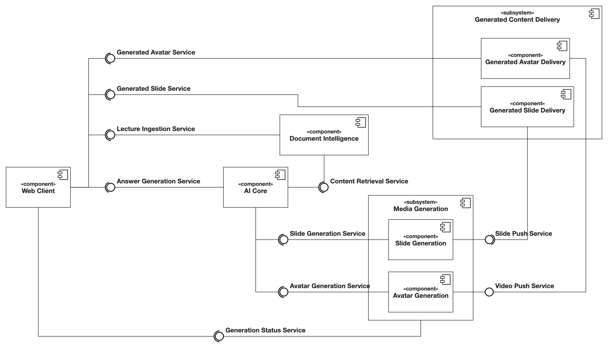

# Orpheus

The Orpheus System transforms static slides into interactive lecture videos with lifelike professor avatars, combining
expressive narration, visual presence, and dynamic content to create engaging, personalized learning experiences.

## Architecture

<!---
The diagram was created with [Apollon](https://apollon.ase.in.tum.de/).
You can edit it by adjusting [OrpheusArchitecture.apollon](./OrpheusArchitecture.apollon).
We recommend using [VsCode](https://code.visualstudio.com/) with the [Apollon Extension](https://marketplace.visualstudio.com/items?itemName=TUMAET.apollon-vscode) to do so.

Once you edited the diagram, make sure to export it as svg to replace the existing [OrpheusArchitecture.png](./OrpheusArchitecture.png).
-->
<div style="text-align: center;">
  
</div>

<!--
TODOS
Open questions:
* Migrate ymls to service levels instead
* "Answer Generation Service" is not an optimal name yet, "Orchestration" might be better but harder to understand what it actually does if you do not know the project at all?
-->

## API Interface Documentation

<!--
TODO 

make sure that services and subteams are actually using the apis from the api folder and generate code from there!
- [] Core Team
- [] Document Intelligence Team
- [] Slides Team
- [] Avatar Team
- [] UI Team
-->

| Service                       | Description                                                                                                              | OpenAPI Specification                                                                                                                                                                                                                                                                              |
|-------------------------------|--------------------------------------------------------------------------------------------------------------------------|----------------------------------------------------------------------------------------------------------------------------------------------------------------------------------------------------------------------------------------------------------------------------------------------------|
| **Answer Generation Service** | Handles user prompts, creates lecture generation jobs, and returns a lectureId                                           | [Answer Generation Service](./api/answer_generation_service.yaml)                                                                                                                                                                                                                                  |
| **Content Retrieval Service** | Extracts and retrieves relevant content from instructor-provided slides and materials to support question answering.     | [Content Retrieval Service](./api/content_retrieval_service.yaml)                                                                                                                                                                                                                                  |
| **Lecture Ingestion Service** | Loads received lectures into vector database and allows deleting information related to already uploaded lecture slides. | [Lecture Ingestion Service](./api/lecture_ingestion_service.yaml)                                                                                                                                                                                                                                  |
| **Slide Generation Service**  | Generates lecture slides that conform to the layout of the respective course from a detailed lecture script.             | [Slide Generation Service](./api/slide_generation_service.yaml)                                                                                                                                                                                                                                    |
| **Slide Push Service**        | Uploads generated slides to the `Generated Avatar Delivery` (CDN) for distribution.                                      |                                                                                                                                                                                                                                                                                                    |
| **Avatar Generation Service** | Produces short videos of lifelike professor avatars from a given text for the voice track with expressive narration.     | [Avatar Generation Service](./api/avatar_generation_service.yaml)                                                                                                                                                                                                                                  |
| **Video Push Service**        | Uploads generated avatar videos to the `Generated Slide Delivery` (CDN) for distribution.                                |                                                                                                                                                                                                                                                                                                    |
| **Content Location Service**  | Returns the CDN location of a slide / avatar video of a related `promptId`.                                              | Note: not these services are not used and implemented yet, currently still relying on polling and respective status requests <br> [Slides Content Location Service](./api/content_location_service_slides.yaml) <br> [Avatar Content Location Service](./api/content_location_service_avatar.yaml) |
| **Generated Avatar Service**  | Provides the generated avatar videos, retrieved by related `promptId`.                                                   | TODO gather info about CDN                                                                                                                                                                                                                                                                         |
| **Generated Slide Service**   | Provides the generated slides, retrieved by related `promptId`.                                                          | TODO gather info about CDN                                                                                                                                                                                                                                                                         |

## Getting Started

### Deployment

TODO - add docker startup commands and instructions

### Development Setup

#### 1. Install Python 3.13.7 using pyenv

The project is based on python 3.13.7.
We recommend using [pyenv](https://github.com/pyenv/pyenv) to manage your python versions.

##### Linux (Debian/Ubuntu)

1. Install system dependencies for building Python (one-time setup)
    ```bash
    sudo apt update
    sudo apt install -y build-essential curl git \
    libssl-dev zlib1g-dev libncurses5-dev libbz2-dev libreadline-dev \
    libsqlite3-dev libffi-dev liblzma-dev tk-dev uuid-dev
    ```
2. Install pyenv (via the pyenv-installer)
    ```bash
    curl https://pyenv.run | bash
    ```
3. Add pyenv to your shell and reload it
    1. For bash
       ```bash
       echo 'export PYENV_ROOT="$HOME/.pyenv"' >> ~/.bashrc
       echo 'command -v pyenv >/dev/null || export PATH="$PYENV_ROOT/bin:$PATH"' >> ~/.bashrc
       echo 'eval "$(pyenv init -)"' >> ~/.bashrc
       ```
    2. For zsh
       ```bash
       echo 'export PYENV_ROOT="$HOME/.pyenv"' >> ~/.zshrc
       echo 'command -v pyenv >/dev/null || export PATH="$PYENV_ROOT/bin:$PATH"' >> ~/.zshrc
       echo 'eval "$(pyenv init -)"' >> ~/.zshrc
       ```
   **Important**: Restart your terminal or run `exec "$SHELL"` for the changes to take effect
   ```bash
   exec "$SHELL"
   ```
4. Install Python 3.13.7 and set it as the global default version

```bash
pyenv install 3.13.7
pyenv global 3.13.7
``` 

5. Verify the installation

```bash
python --version
```

Expected output: Python 3.13.7

##### macOS

1. Install Homebrew if you haven't already
    ```bash
    /bin/bash -c "$(curl -fsSL https://raw.githubusercontent.com/Homebrew/install/HEAD/install.sh)"
    ```
2. Install pyenv
    ```bash
    brew install pyenv
    ```
3. Add pyenv to your shell and reload it
   For zsh (the default on modern macOS):
   ```bash
   echo 'export PYENV_ROOT="$HOME/.pyenv"' >> ~/.zshrc
   echo 'command -v pyenv >/dev/null || export PATH="$PYENV_ROOT/bin:$PATH"' >> ~/.zshrc
   echo 'eval "$(pyenv init -)"' >> ~/.zshrc
   ```
   **Important**: Restart your terminal or run `exec "$SHELL"` for the changes to take effect
   ```bash
   exec "$SHELL"
   ```
4. Install Python 3.13.7 and set it as the global default version
   ```bash
   pyenv install 3.13.7
   pyenv global 3.13.7
   ```
5. Verify the installation
   ```bash
   python --version
   ```
   Expected output: Python 3.13.7

##### Windows (PowerShell, run as Administrator)

1. Install pyenv-win via PowerShell
    ```powershell
    Invoke-WebRequest -UseBasicParsing -Uri "https://raw.githubusercontent.com/pyenv-win/pyenv-win/master/pyenv-win/install-pyenv-win.ps1" -OutFile "./install-pyenv-win.ps1"; &"./install-pyenv-win.ps1"; Remove-Item "./install-pyenv-win.ps1"
    ```
2. Add pyenv to your PowerShell session
   The following lines are automatically added to your $PROFILE.
   You may need to run them manually for the current session or restart your terminal.
    ```powershell
    $env:PYENV = [System.Environment]::GetEnvironmentVariable('PYENV','User')
    $env:PYENV_HOME = [System.Environment]::GetEnvironmentVariable('PYENV_HOME','User')
    $env:PYENV_ROOT = [System.Environment]::GetEnvironmentVariable('PYENV_ROOT','User')
    $env:Path = [System.Environment]::GetEnvironmentVariable('path','User')
    ```
   **Important**: Restart your PowerShell window to ensure the PATH changes are active.
3. Update pyenv-win to get the latest list of available versions
    ```powershell
    pyenv update
    ``` 
4. Install Python 3.13.7 and set it as the global default version
    ```powershell
    pyenv install 3.13.7
    pyenv global 3.13.7
    ```
5. Verify the installation
    ```powershell
    python --version
    ```
   Expected output: Python 3.13.7

   (Optional) Check which version pyenv is managing
    ```powershell
    pyenv version
    ```
   Expected output: 3.13.7 (set by C:\Users\YourUser\.pyenv\pyenv-win\version)

#### 2. Install Poetry 2.2.1

We use [Poetry](https://python-poetry.org/) as our dependency and environment management tool.

##### Linux / macOS

1. Install Poetry using the official installer script
    ```bash
    curl -sSL https://install.python-poetry.org | python3 -
    ```
2. Update Poetry to version 2.2.1
    ```bash
    ~/.local/bin/poetry self update 2.2.1
    ```
3. Ensure Poetry is on PATH for the current shell session
    ```bash
    export PATH="$HOME/.local/bin:$PATH"
    ```
    1. Persist Poetry on PATH for **bash**
        ```bash
        echo 'export PATH="$HOME/.local/bin:$PATH"' >> ~/.bashrc
        ```
    2. Persist Poetry on PATH for **zsh**
        ```bash
        echo 'export PATH="$HOME/.local/bin:$PATH"' >> ~/.zshrc
        ```
4. Verify Poetry installation
    ```bash
    poetry --version
    ```

##### Windows (PowerShell)

1. Install Poetry using the official installer script
    ```powershell
    (Invoke-WebRequest -Uri https://install.python-poetry.org -UseBasicParsing).Content | python -
    ```
   Poetry is typically installed under:
    ```
    $env:APPDATA\Python\Scripts
    ```
2. Update Poetry to version 2.2.1
    ```powershell
    poetry self update 2.2.1
    ```
3. Ensure Poetry is on PATH for the current PowerShell session
    ```powershell
    $env:Path += ";$env:APPDATA\Python\Scripts"
    ```
4. Persist Poetry on PATH for future sessions
    ```powershell
    setx PATH "$($env:PATH)"
    ```
5. Verify Poetry installation
    ```powershell
    poetry --version
    ```