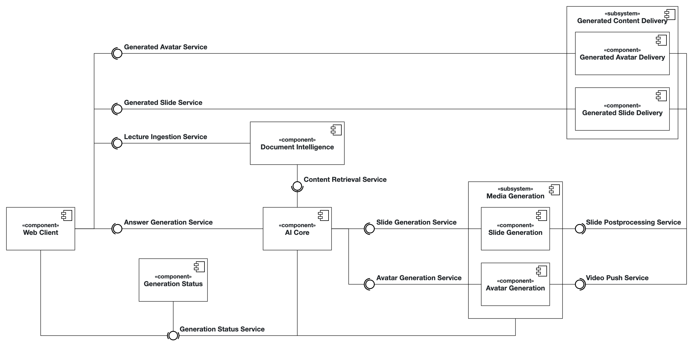
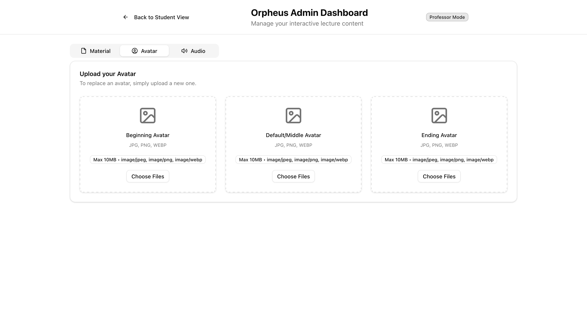
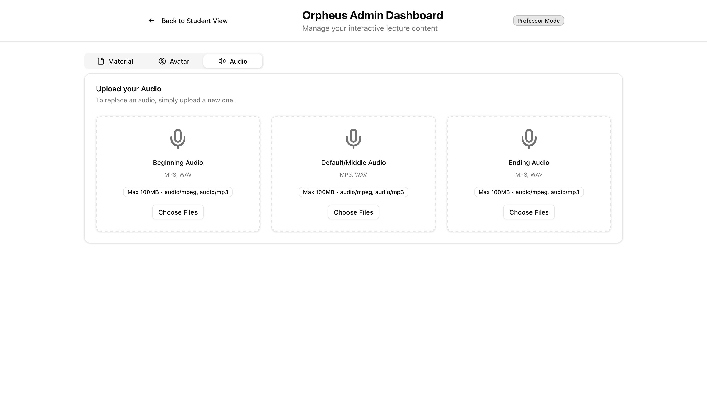
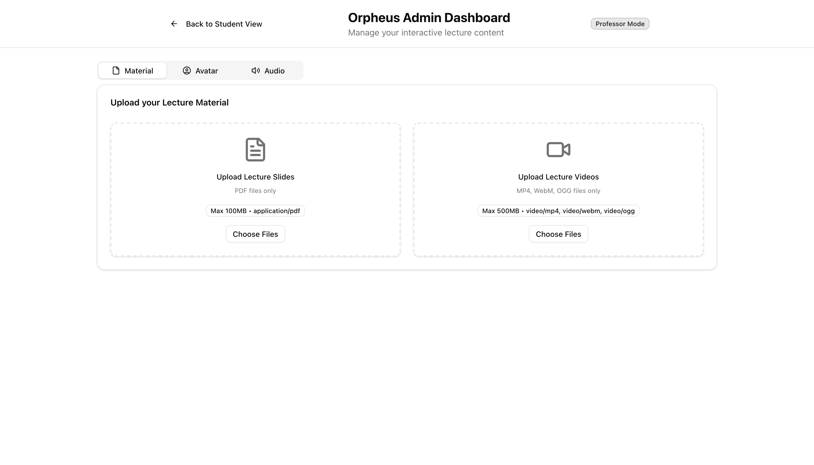
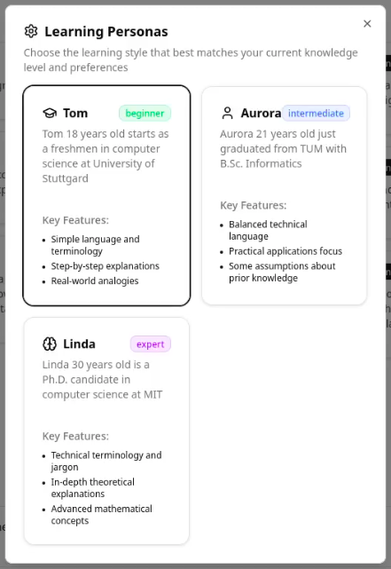
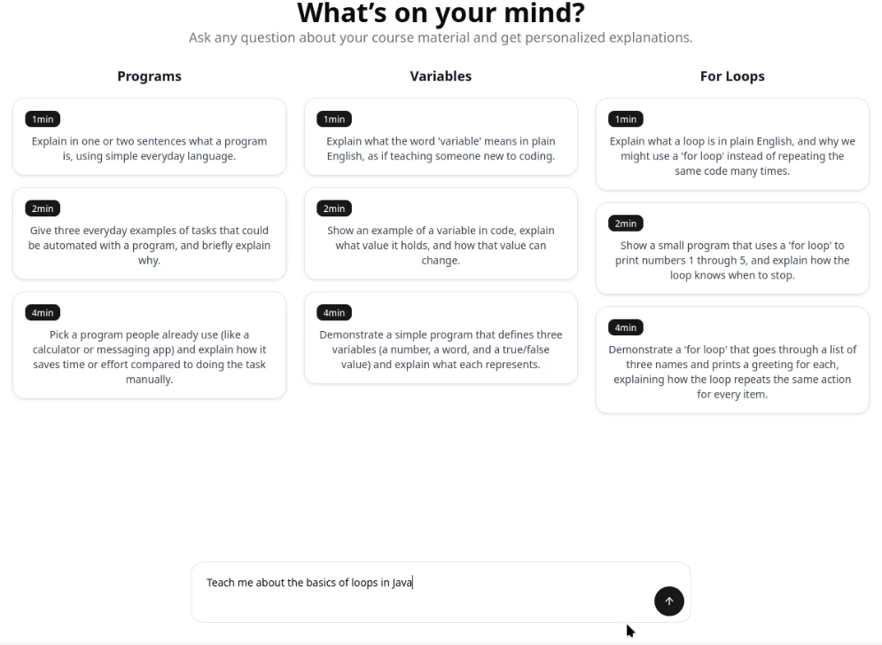
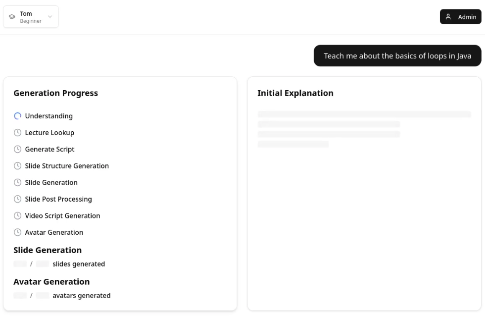
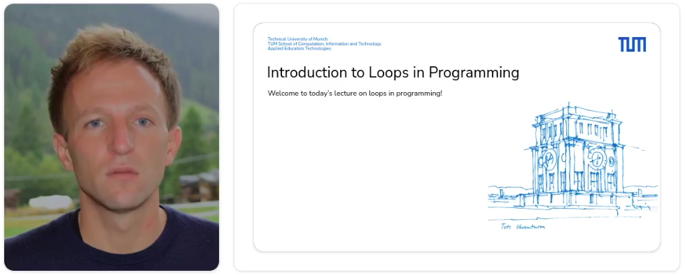

# Orpheus

The Orpheus System transforms static slides into interactive lecture videos with lifelike professor avatars, combining
expressive narration, visual presence, and dynamic content to create engaging, personalized learning experiences.

## Table of Contents

- [Architecture](#architecture)
    - [Service Components](#service-components)
    - [API Interface Documentation](#api-interface-documentation)
- [Getting Started](#getting-started)
    - [User Guide](#user-guide)
        - [Lecturer View](#lecturer-view)
        - [Student View](#student-view)
    - [Development Setup](#development-setup)
        - [1. Install Python 3.13.7 using pyenv](#1-install-python-31317-using-pyenv)
            - [Linux (Debian/Ubuntu)](#linux-debianubuntu)
            - [macOS](#macos)
            - [Windows (PowerShell, run as Administrator)](#windows-powershell-run-as-administrator)
        - [2. Install Poetry 2.2.1](#2-install-poetry-221)
            - [Linux / macOS](#linux--macos)
            - [Windows (PowerShell)](#windows-powershell)
    - [Deployment](#deployment)

## Architecture

<!---
The diagram was created with [Apollon](https://apollon.ase.in.tum.de/).
You can edit it by adjusting [OrpheusArchitecture.apollon](./OrpheusArchitecture.apollon).
We recommend using [VsCode](https://code.visualstudio.com/) with the [Apollon Extension](https://marketplace.visualstudio.com/items?itemName=TUMAET.apollon-vscode) to do so.

Once you edited the diagram, make sure to export it as svg to replace the existing [OrpheusArchitecture.png](./OrpheusArchitecture.png).
-->
<div style="text-align: center;">
  
</div>

### Service Components

The Orpheus system is composed of multiple specialized services, each handling different aspects of the lecture
generation pipeline. Below you can find links to the technology-specific documentation and implementation details for
each service component.

| Service                           | Documentation                                                                             |
|-----------------------------------|-------------------------------------------------------------------------------------------|
| **Avatar Service**                | [orpheus/avatar](https://github.com/fa25genai/orpheus/tree/develop/avatar)                |
| **Core Service**                  | [orpheus/core](https://github.com/fa25genai/orpheus/tree/develop/core)                    |
| **Document Intelligence Service** | [orpheus/docint](https://github.com/fa25genai/orpheus/tree/develop/document-intelligence) |
| **Slides Service**                | [orpheus/slides](https://github.com/fa25genai/orpheus/tree/develop/slides)                |
| **Status Service**                | [orpheus/status](https://github.com/fa25genai/orpheus/tree/develop/status)                |
| **User Interface**                | [orpheus/ui](https://github.com/fa25genai/orpheus/tree/develop/ui)                        |

### API Interface Documentation

<!--
TODO 

make sure that services and subteams are actually using the apis from the api folder and generate code from there!
- [] Document Intelligence Team
- [] Avatar Team

-->

| Service                          | Description                                                                                                              | OpenAPI Specification                                                   |
|----------------------------------|--------------------------------------------------------------------------------------------------------------------------|-------------------------------------------------------------------------|
| **Answer Generation Service**    | Handles user prompts, creates lecture generation jobs, and returns a lectureId.                                          | [Answer Generation Service](./api/answer_generation_service.yaml)       |
| **Avatar Generation Service**    | Produces short videos of lifelike professor avatars from a given text for the voice track with expressive narration.     | [Avatar Generation Service](./api/avatar_generation_service.yaml)       |
| **Content Retrieval Service**    | Extracts and retrieves relevant content from instructor-provided slides and materials to support question answering.     | [Content Retrieval Service](./api/content_retrieval_service.yaml)       |
| **Generation Status Service**    | Handles the status of a lecture generation job.                                                                          | [Generation Status Service](./api/generation_status_service.yaml)       |
| **Generated Avatar Service**     | Provides the generated avatar videos, retrieved by related `promptId`.                                                   | [Generated Avatar Service](avatar/assets/README.md)                     |
| **Generated Slide Service**      | Provides the generated slides. Retrieval is done with the related `promptId`.                                            | [Generated Slides Service](slides/delivery/README.md)                   |
| **Lecture Ingestion Service**    | Loads received lectures into vector database and allows deleting information related to already uploaded lecture slides. | [Lecture Ingestion Service](./api/lecture_ingestion_service.yaml)       |
| **Slide Generation Service**     | Generates lecture slides that conform to the layout of the respective course from a detailed lecture script.             | [Slide Generation Service](./api/slide_generation_service.yaml)         |
| **Slide Postprocessing Service** | Converts slides to HTML and uploads generated code to the `Generated Slide Delivery` (CDN) for distribution.             | [Slide Postprocessing Service](./api/slide_postprocessing_service.yaml) |
| **Video Push Service**           | Uploads generated avatar videos to the `Generated Avatar Delivery` (CDN) for distribution.                               | TODO gather info                                                        |

## Getting Started

### User Guide

#### Lecturer View

The **lecturer view** can be accessed via the **Admin Button** located at the top right.

To personalize the course delivery, the lecturer is required to upload both **avatar images** and **voice samples**,
followed by the relevant **course materials**.

---

##### 👤 Avatar Uploads

<div style="text-align: center;">
  
</div>

Three distinct avatars should be provided to represent different stages of the lecture:

- **Beginning Avatar**
    - Used at the beginning of the lecture.
    - Recommended: a **happy facial expression** to create a welcoming atmosphere.

- **Default/Middle Avatar**
    - Used during the main lecture delivery.
    - Recommended: a **neutral facial expression** to maintain focus.

- **Ending Avatar**
    - Used at the end of the lecture.
    - Recommended: a **happy facial expression** to close on a positive note.

---

##### 🎙️ Voice Samples

<div style="text-align: center;">
  
</div>

Similarly, three voice samples should be uploaded, aligned with the same lecture stages as the avatars:

- **Beginning Voice Sample** — welcoming and engaging.
- **Default/Middle Voice Sample** — clear and neutral delivery.
- **Ending Voice Sample** — positive and encouraging tone.

---

##### 📑 Course Materials

<div style="text-align: center;">
  
</div>

- Upload course slides and/or pre-recorded lecture videos.
- These materials will be processed and integrated into the system by the **Document Intelligence Team**.
- For further details, refer to the [Document Intelligence README](./document-intelligence/README.md).

---

#### Student View

1. Choose your level of expertise by selecting a suitable character:
   

2. Enter your question or choose from the predefined ones:
   

3. Wait for for the generation process. In the meantime a textual answer will be given. The lectre will start as soon as
   the first video is done:
   

4. Watch the video:
   

### Development Setup

#### Environment Variables

1. Add a `.env` file in the root directory
    ```bash
    cp exampleEnv .env
    ```
2. Make sure to supply values for at least one AI-Model (e.g. AWS) and define the respective model names (`MODEL_NAME`,
   `SPLITTING_MODEL`, `SLIDESGEN_MODEL`)
    1. How to get AWS Keys?
        1. You need an AWS Hackathon Account
        2. Go to https://slalom-hackathon.awsapps.com/start/#/?tab=accounts
        3. Go to slalom_IsbUsersPS
        4. ...
3. You can overwrite the global `.env` file values with service specific `.env` files

#### 1. Install Python 3.13.7 using pyenv

The project is based on python 3.13.7.
We recommend using [pyenv](https://github.com/pyenv/pyenv) to manage your python versions.

##### Linux (Debian/Ubuntu)

1. Install system dependencies for building Python (one-time setup)
    ```bash
    sudo apt update
    sudo apt install -y build-essential curl git \
    libssl-dev zlib1g-dev libncurses5-dev libbz2-dev libreadline-dev \
    libsqlite3-dev libffi-dev liblzma-dev tk-dev uuid-dev
    ```
2. Install pyenv (via the pyenv-installer)
    ```bash
    curl https://pyenv.run | bash
    ```
3. Add pyenv to your shell and reload it
    1. For bash
       ```bash
       echo 'export PYENV_ROOT="$HOME/.pyenv"' >> ~/.bashrc
       echo 'command -v pyenv >/dev/null || export PATH="$PYENV_ROOT/bin:$PATH"' >> ~/.bashrc
       echo 'eval "$(pyenv init -)"' >> ~/.bashrc
       ```
    2. For zsh
       ```bash
       echo 'export PYENV_ROOT="$HOME/.pyenv"' >> ~/.zshrc
       echo 'command -v pyenv >/dev/null || export PATH="$PYENV_ROOT/bin:$PATH"' >> ~/.zshrc
       echo 'eval "$(pyenv init -)"' >> ~/.zshrc
       ```
   **Important**: Restart your terminal or run `exec "$SHELL"` for the changes to take effect
   ```bash
   exec "$SHELL"
   ```
4. Install Python 3.13.7 and set it as the global default version

```bash
pyenv install 3.13.7
pyenv global 3.13.7
``` 

5. Verify the installation

```bash
python --version
```

Expected output: Python 3.13.7

##### macOS

1. Install Homebrew if you haven't already
    ```bash
    /bin/bash -c "$(curl -fsSL https://raw.githubusercontent.com/Homebrew/install/HEAD/install.sh)"
    ```
2. Install pyenv
    ```bash
    brew install pyenv
    ```
3. Add pyenv to your shell and reload it
   For zsh (the default on modern macOS):
   ```bash
   echo 'export PYENV_ROOT="$HOME/.pyenv"' >> ~/.zshrc
   echo 'command -v pyenv >/dev/null || export PATH="$PYENV_ROOT/bin:$PATH"' >> ~/.zshrc
   echo 'eval "$(pyenv init -)"' >> ~/.zshrc
   ```
   **Important**: Restart your terminal or run `exec "$SHELL"` for the changes to take effect
   ```bash
   exec "$SHELL"
   ```
4. Install Python 3.13.7 and set it as the global default version
   ```bash
   pyenv install 3.13.7
   pyenv global 3.13.7
   ```
5. Verify the installation
   ```bash
   python --version
   ```
   Expected output: Python 3.13.7

##### Windows (PowerShell, run as Administrator)

1. Install pyenv-win via PowerShell
    ```powershell
    Invoke-WebRequest -UseBasicParsing -Uri "https://raw.githubusercontent.com/pyenv-win/pyenv-win/master/pyenv-win/install-pyenv-win.ps1" -OutFile "./install-pyenv-win.ps1"; &"./install-pyenv-win.ps1"; Remove-Item "./install-pyenv-win.ps1"
    ```

<details>
<summary>Troubleshooting Common Installation Issues</summary>

### 1. Script Execution is Disabled

- **Issue:** You receive an error in PowerShell stating
  `...cannot be loaded because running scripts is disabled on this system.`
- **What to do:** This is due to PowerShell's Execution Policy. Run PowerShell as **Administrator** and execute the
  following command to allow the script to run for the current session, then try the installation command again.
  ```powershell
  Set-ExecutionPolicy -ExecutionPolicy RemoteSigned -Scope Process
  ```

### 2. `pyenv` Command Not Found After Installation

- **Issue:** After the installer finishes, opening a new terminal and typing `pyenv` results in a `command not found`
  error.
- **What to do:** The installer couldn't modify your User `PATH` environment variable correctly, or your terminal
  session needs to be refreshed.
    1. **Restart your terminal:** Close and reopen PowerShell/CMD completely.
    2. **Restart your computer:** A full restart will ensure environment variables are reloaded.
    3. **Manually add to PATH:** If it still fails, you must add the following two paths to your User `PATH` environment
       variables.
        - `%USERPROFILE%\.pyenv\pyenv-win\bin`
        - `%USERPROFILE%\.pyenv\pyenv-win\shims`

### 3. System Python Overrides `pyenv` Version

- **Issue:** You've set a Python version with `pyenv global` or `pyenv local`, but running `python --version` shows your
  old system version (or opens the Microsoft Store).
- **What to do:** This is a `PATH` priority issue.
    1. **Disable Windows App Execution Aliases:** Go to `Start > Manage App Execution Aliases` and turn **off** the
       aliases for `python.exe` and `python3.exe`. This is the most common cause.
    2. **Check your `PATH` order:** Ensure the `pyenv` `shims` and `bin` paths appear *before* any other Python
       installation paths in your environment variables.

### 4. Shims Are Not Working for New Packages

- **Issue:** You install a package with a command-line tool (like `pipx` or `poetry`) using `pip`, but the command isn't
  available in your terminal.
- **What to do:** You need to rebuild the `pyenv` shims so it's aware of the new executable.
  ```powershell
  pyenv rehash
  ```

</details>
2. Add pyenv to your PowerShell session
   The following lines are automatically added to your $PROFILE.
   You may need to run them manually for the current session or restart your terminal.
    ```powershell
    $env:PYENV = [System.Environment]::GetEnvironmentVariable('PYENV','User')
    $env:PYENV_HOME = [System.Environment]::GetEnvironmentVariable('PYENV_HOME','User')
    $env:PYENV_ROOT = [System.Environment]::GetEnvironmentVariable('PYENV_ROOT','User')
    $env:Path = [System.Environment]::GetEnvironmentVariable('path','User')
    ```
   **Important**: Restart your PowerShell window to ensure the PATH changes are active.
3. Update pyenv-win to get the latest list of available versions
    ```powershell
    pyenv update
    ``` 
4. Install Python 3.13.7 and set it as the global default version
    ```powershell
    pyenv install 3.13.7
    pyenv global 3.13.7
    ```
5. Verify the installation
    ```powershell
    python --version
    ```
   Expected output: Python 3.13.7

(Optional) Check which version pyenv is managing

```powershell
pyenv version
```

Expected output: 3.13.7 (set by C:\Users\YourUser\.pyenv\pyenv-win\version)

#### 2. Install Poetry 2.2.1

We use [Poetry](https://python-poetry.org/) as our dependency and environment management tool.

##### Linux / macOS

1. Install Poetry using the official installer script
    ```bash
    curl -sSL https://install.python-poetry.org | python3 -
    ```
2. Update Poetry to version 2.2.1
    ```bash
    ~/.local/bin/poetry self update 2.2.1
    ```
3. Ensure Poetry is on PATH for the current shell session
    ```bash
    export PATH="$HOME/.local/bin:$PATH"
    ```
    1. Persist Poetry on PATH for **bash**
        ```bash
        echo 'export PATH="$HOME/.local/bin:$PATH"' >> ~/.bashrc
        ```
    2. Persist Poetry on PATH for **zsh**
        ```bash
        echo 'export PATH="$HOME/.local/bin:$PATH"' >> ~/.zshrc
        ```
4. Verify Poetry installation
    ```bash
    poetry --version
    ```

##### Windows (PowerShell)

1. Install Poetry using the official installer script
    ```powershell
    (Invoke-WebRequest -Uri https://install.python-poetry.org -UseBasicParsing).Content | python -
    ```
   Poetry is typically installed under:
    ```
    $env:APPDATA\Python\Scripts
    ```
2. Update Poetry to version 2.2.1
    ```powershell
    poetry self update 2.2.1
    ```
3. Ensure Poetry is on PATH for the current PowerShell session
    ```powershell
    $env:Path += ";$env:APPDATA\Python\Scripts"
    ```
4. Persist Poetry on PATH for future sessions
    ```powershell
    setx PATH "$($env:PATH)"
    ```
5. Verify Poetry installation
    ```powershell
    poetry --version
    ```

### Deployment

Run this command in your root directory to build all services, start them up under the project name orpheus, and pull
any necessary images:

```bash
docker compose -p orpheus up --build
```